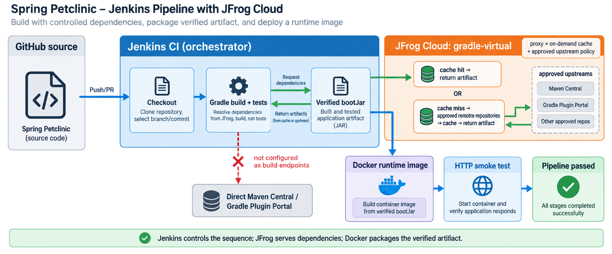

# Spring Petclinic: Jenkins + JFrog Cloud

This repository implements the required JFrog Professional Services Engineer
assignment: Jenkins compiles and tests Spring Petclinic, Gradle resolves its
plugins and dependencies through JFrog Cloud, Docker packages the verified JAR,
and Jenkins smoke-tests the resulting image.



## Architecture

Jenkins is the pipeline orchestrator. It binds a JFrog credential, runs one
Gradle build, and then gives the tested JAR to Docker:

1. Jenkins checks out the repository.
2. Gradle resolves plugins and project dependencies from the JFrog
   `gradle-virtual` repository.
3. JFrog serves cached artifacts or proxies requests to its configured,
   approved upstream repositories.
4. Gradle runs the tests and creates the executable Spring Boot JAR.
5. Docker packages that exact JAR into a Java 17 runtime image.
6. Jenkins starts the image on an ephemeral port and performs an HTTP smoke
   test.

There is no second Gradle build inside Docker. This keeps dependency resolution
on the authenticated JFrog path and ensures that the image contains the same
artifact Jenkins tested.

## Assignment files

- `Jenkinsfile` — checkout, authenticated Gradle build, test reporting, image
  packaging, and smoke test.
- `Dockerfile` — minimal runtime-only Java 17 image.
- `.dockerignore` — allows only the Dockerfile and built JAR into the build
  context.
- `build.gradle` and `settings.gradle` — JFrog-backed dependency and plugin
  resolution when the JFrog variables are supplied.

## Jenkins setup

Create a Pipeline job from this repository's `main` branch and configure one
Jenkins username/password credential:

```text
Credential ID: jfrog-cloud-gradle
Username:      JFrog account username
Password:      JFrog identity token
```

The repository endpoint is public configuration and contains no secret:

```text
https://trialbf1216.jfrog.io/artifactory/gradle-virtual
```

Jenkins injects the username and token only while Gradle is running. It builds
with:

```bash
./gradlew clean test bootJar
```

The pipeline publishes JUnit results, uses build-specific image/container
names, limits job concurrency and runtime, and prints container logs when the
smoke test fails.

## Build and run locally

Requirements: Java 17, Docker, and the project's checked-in Gradle wrapper.

To reproduce the JFrog-backed build, supply credentials through the environment
from a private source:

```bash
export JFROG_GRADLE_REPOSITORY_URL='https://trialbf1216.jfrog.io/artifactory/gradle-virtual'
export JFROG_USERNAME='your-jfrog-username'
export JFROG_IDENTITY_TOKEN='your-jfrog-identity-token'

./gradlew clean test bootJar
docker build --tag spring-petclinic:local .
docker run --rm --name spring-petclinic --publish 8080:8080 spring-petclinic:local
```

Open <http://localhost:8080/>. The credentials are needed only for Gradle; they
are not passed to Docker or stored in the image.

For reviewers without JFrog credentials, leaving the three JFrog variables
unset activates the project's public-repository fallback. The Jenkins pipeline
always sets the JFrog URL and binds the private credential.

## Dependency provenance

The verified security boundary is that the Gradle client talks to JFrog rather
than contacting Maven Central directly. JFrog may then serve its cache or proxy
an approved upstream repository, which is the intended behavior.

The path was verified with an empty Gradle cache and dependency refresh:

```bash
GRADLE_USER_HOME="$(mktemp -d)" \
  ./gradlew --no-daemon --refresh-dependencies test bootJar --info
```

The resulting log contained requests to the JFrog virtual repository and no
direct requests to `repo.maven.apache.org`. `--refresh-dependencies` is kept as
a provenance test rather than imposed on every Jenkins build, so normal CI can
reuse JFrog and Gradle caches.

On commit `084fc61`, the same check ran in the Java 17 Jenkins container with a
fresh Gradle cache: it completed successfully in 1m 53s, recorded 927 JFrog
virtual-repository requests, and recorded no direct Maven Central requests.

## Runnable image deliverable

After the local commands above, run the image with:

```bash
docker run --rm --publish 8080:8080 spring-petclinic:local
```

To attach it as a file to the submission:

```bash
docker save --output spring-petclinic.tar spring-petclinic:local
shasum -a 256 spring-petclinic.tar
```

The image archive is a submission artifact and should not be committed to Git.

## Optional self-hosted bonus

The required JFrog Cloud implementation is complete. The optional self-hosted
Artifactory deployment is intentionally not included; the same configurable
Gradle repository URL can point the pipeline at a self-hosted virtual
repository if the bonus is added later.
